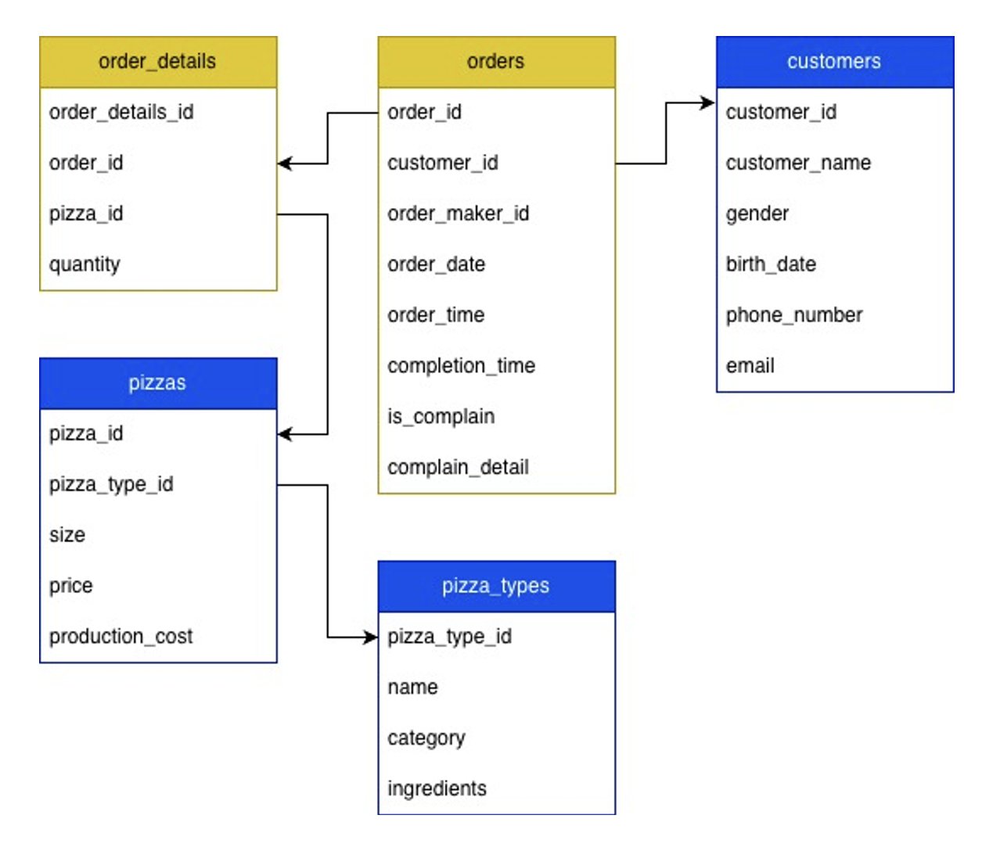
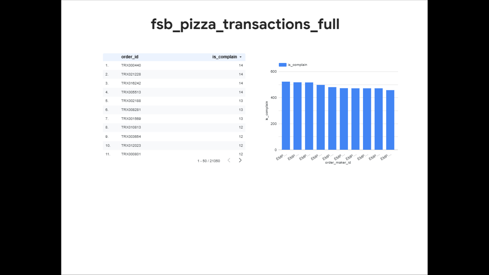

# 🍕 FSB Pizza Data Pipeline (End-to-End ETL)

## 📖 Project Background
**FSB Pizza (From Scratch Bakery Pizza)** is a restaurant specializing in direct sales (dine-in and take-away). Throughout its operations, FSB Pizza has collected sales transaction data; however, the utilization of this data remains limited and not optimally integrated to support data-driven decision-making.

**The Objective:**
As a Data Engineer, the goal is to build a structured **Data Warehouse** to consolidate transaction and operational data into a single centralized source. This data will subsequently be processed and presented through visualizations and interactive dashboards to help management:
* Monitor sales performance.
* Identify trends.
* Discover opportunities to increase efficiency and revenue.

By implementing the right data architecture, FSB Pizza aims to transform into a more effective, efficient, and **data-driven** operation.

## 🗂️ Data Sources & ERD
The raw data is sourced from a REST API provided by the FSB Pizza backend team. The data ecosystem consists of **5 main tables** that form the Entity Relationship Diagram (ERD):

### API Endpoints
Base URL: `https://fsbproject.vercel.app/`

| Table Name | Endpoint Description | API URL |
| :--- | :--- | :--- |
| **Customer** | Registered customer data | `/customer` |
| **Pizza** | Pizza menu items & prices | `/pizza` |
| **Pizza Type** | Categories of pizza | `/pizza_type` |
| **Order** | Header transaction data | `/order` |
| **Order Detail**| Itemized transaction details | `/order_detail` |

### Metadata Schema
Each table contains the following metadata columns for audit purposes:
* `created_date`: Timestamp when the record was created.
* `updated_date`: Timestamp when the record was last modified.

## 🏗️ Architecture & Project Structure
The project follows a production-ready directory structure:

fsb-data-pipeline/  
│  
├── config/              # Configuration files (YAML)  
│   └── config.yaml      # Database & API configurations  
│  
├── etl/                 # Core ETL Logic Modules  
│   ├── extract.py       # Fetches raw data from API  
│   ├── transform.py     # Cleans & formats data (Type casting, etc.)  
│   └── load.py          # Uploads data to BigQuery  
│  
├── pipelines/           # Orchestration Scripts  
│   └── ingest_data.py   # Main entry point to run the pipeline  
│  
├── src/                 # Shared Utilities  
│   └── schema_generator.py    # Helper functions (BigQuery Connection)  
│   └── connect_gbq.py         # Helper functions (Schema Gen)  
│  
├── notebooks/           # Jupyter Notebooks for experimentation  
│   └── google-colab.ipynb  
│  
├── requirements.txt     # Python dependencies  
└── README.md            # Project documentation  

## 🚀 Prerequisites
* Before running the pipeline, ensure you have:
* Python 3.8+ installed.
* Google Cloud Platform (GCP) account with BigQuery enabled.
* Service Account Key (JSON) with BigQuery Admin or Data Editor role.

## 🛠️ Installation & Setup
* Clone the Repository
* Install Dependencies
It is recommended to use a virtual environment.

Bash
pip install -r requirements.txt
Configure Credentials

* Place your GCP Service Account JSON key in the config/ folder.
IMPORTANT: Rename the file or update config/config.yaml to match your key filename.
Note: The JSON key is git-ignored for security.

* Update Configuration
Edit config/config.yaml to match your Project ID:

YAML  
project_id: "de-fsb-2026"  
api_base_url: "[https://fsbproject.vercel.app/](https://fsbproject.vercel.app/)"  
service_account_key: "config/your-key-file.json"  

## ▶️ Usage
To run the pipeline for a specific dataset (e.g., Orders), run the following command from the root directory:

Bash  
python -m pipelines.ingest_data \  
  --data_name="order" \  
  --dataset_name="data_landing" \  
  --dest_table_name="trx_orders"  

Arguments:  
--data_name: Endpoint name from the API (e.g., order, customer, pizza).  
--dataset_name: Destination Dataset ID in BigQuery.  
--dest_table_name: Destination Table ID in BigQuery.  

## 📊 Dashboard

[Link to Dashboard](https://lookerstudio.google.com/reporting/f9424be0-a07f-4aef-b90a-16bf235ab472)  
The final data is visualized in Looker Studio to track Sales Performance and Customer Trends.

## 👤 Author
Fajar Aji Pamungkas  
LinkedIn: linkedin.com/in/fajaraji25  
GitHub: github.com/fajaraji  

Created as part of the FullStack Bangalore Data Engineering Bootcamp Final Project.